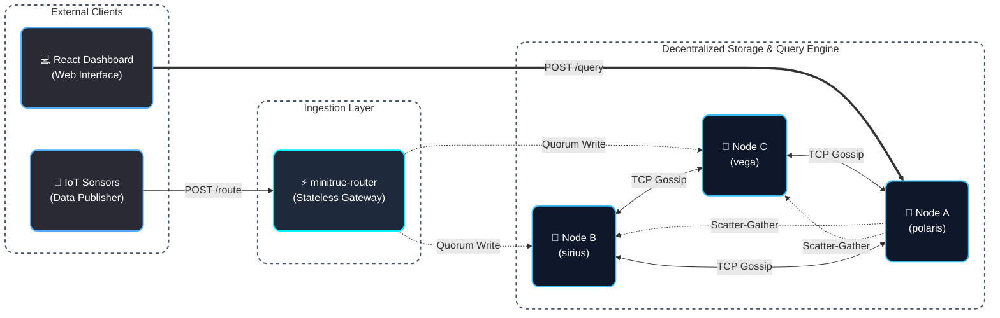
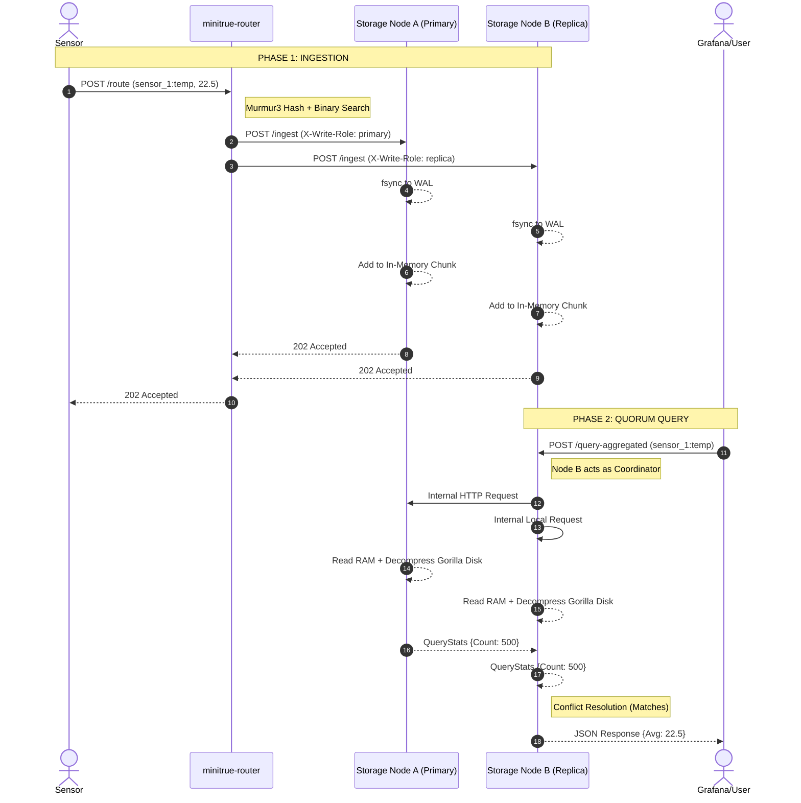
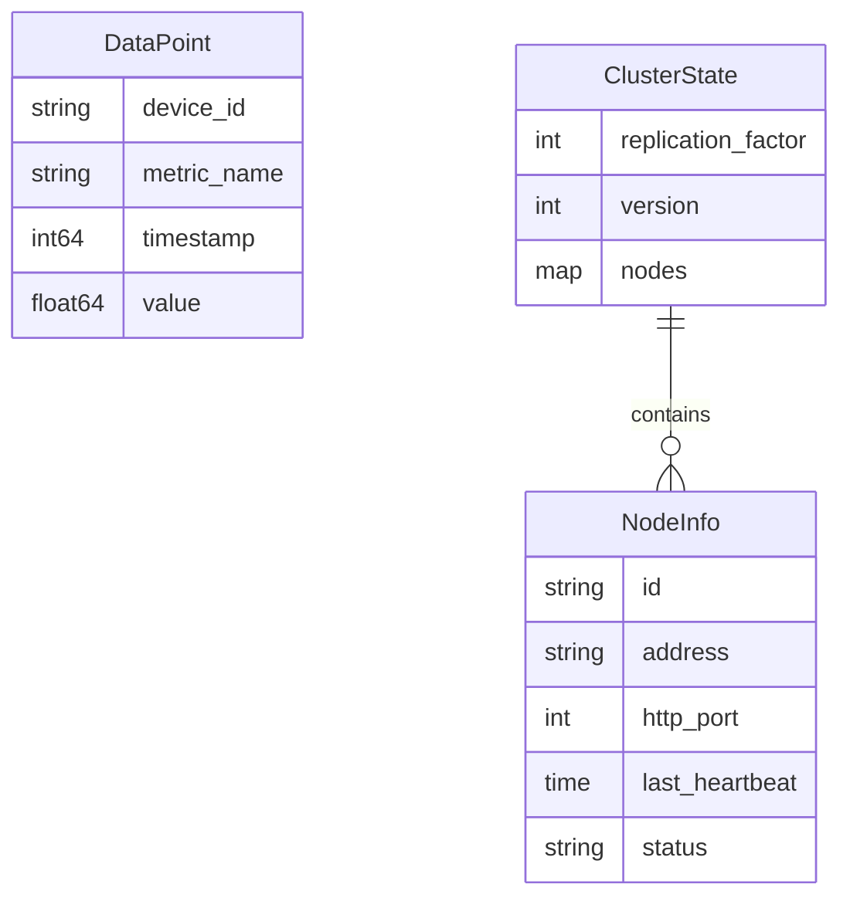

# MiniTrue Time Series Database

[](https://minitrue.vercel.app)
[]()
[](https://golang.org)
[]()

MiniTrue is a high-performance, decentralized, leaderless Time-Series Database (TSDB) written entirely in Go. It is purpose-built to handle massive, chaotic, and high-frequency data streams generated by IoT sensors.

**Deployment**: The fully functional React frontend is deployed on [Vercel](https://minitrue.vercel.app), which interfaces directly with the Go backend storage cluster deployed as web services on [Render]().

## What We Built & Why It's Needed
Traditional relational databases (like PostgreSQL or MySQL) are fantastic for transactional data but often buckle under the sheer volume and velocity of IoT time-series data. IoT sensors fire data continuously, often out-of-order due to network lag, causing massive disk I/O bottlenecks and exploding storage costs.

**MiniTrue** solves this by reimagining the database architecture from the ground up:
*   **Write-Heavy Optimized**: Uses in-memory chunking and Write-Ahead Logs (WAL) to absorb high-velocity writes without thrashing the disk.
*   **Massive Space Reduction**: Implements Facebook's Gorilla Compression algorithm to squash timestamps and floats, reducing disk usage by up to 90%.
*   **Masterless Scalability**: Uses a Dynamo-style leaderless architecture. There is no single point of failure. You can add or remove nodes on the fly, and the cluster self-heals using a Gossip Protocol and Consistent Hashing.

---

## Complete System Overview

MiniTrue is divided into four highly specialized, decoupled layers:
1.  **The Routing Layer**: A stateless HTTP gateway that calculates data placement using Consistent Hashing Algorithm.
2.  **The Storage Layer**: The physical engine that handles WAL durability, RAM buffering, Gorilla compression, and Tombstone deletions.
3.  **The Cluster Management Layer**: A peer-to-peer network utilizing Gossip Protocols and Merkle Trees to maintain global state without a master node.
4.  **The Query Layer**: A decentralized engine that performs Quorum reads and on-the-fly conflict resolution.



---

## In-Depth Architectural Design

### 1. Ingestion & Routing (`minitrue-router`)
The system starts with IoT sensors publishing data to a stateless HTTP API Gateway (the Router). 
*   **Protocol & Algorithm**: The router extracts the `deviceID:metricName` from the incoming payload and hashes it using the **Murmur3** hashing algorithm. 
*   **Consistent Hashing**: The router maintains a virtual Hash Ring (with 150 virtual nodes per physical server to ensure even data distribution). It performs a **Binary Search** (`O(log N)`) to find the nearest node clockwise on the ring.
*   **Synchronous Replication**: The router walks the ring to find `N` distinct physical nodes (where `N` is the Replication Factor). It forwards the data to the Primary and Replica synchronously. The client is only acknowledged once both nodes confirm they have saved the data.

### 2. The Storage Engine & Durability (`internal/storage`)
When a node receives data, it goes through a strict physical lifecycle:
*   **Write-Ahead Log (WAL)**: To guarantee crash durability, the raw bytes are immediately appended to `wal.log` and forcefully `fsync`'d to the disk.
*   **In-Memory Chunking**: The data is placed in RAM and sorted. This handles out-of-order packets and makes recent queries `O(1)` fast.
*   **Gorilla Compression**: Once 1,000 points accumulate in RAM, they are flushed to an immutable `.parq` segment file on disk. Timestamps use **Delta-of-Delta encoding**, and values use **XOR encoding**.
*   **Tombstone Deletions**: Because segment files are immutable, deletions are handled via the Tombstone Protocol. A `.tomb` file is dropped on disk and flagged in an `O(1)` memory map. Queries silently mask the data, and background compaction physically shreds the files later.

### 3. Cluster Management & Self-Healing (`internal/cluster`)
There is no central database (like Zookeeper) tracking who is alive.
*   **Gossip Protocol**: Every node randomly whispers its state to 3 peers every few seconds. This Epidemic Algorithm ensures the entire cluster learns of changes (node death/joins) in milliseconds.
*   **Merkle Trees**: To prevent network congestion, nodes don't send full lists. They hash the states into a Merkle Tree and share the **Root Hash**. If two nodes have the same Root Hash, they are perfectly in sync. If not, they execute Anti-Entropy to trade missing information.
*   **Sync Manager & Rate Limiting**: If a node joins or dies, the Hash Ring shifts. Nodes instantly realize they are missing data. The **Migration Hook** fires, dropping tasks into a non-blocking **Sync Queue**. A fixed worker pool (e.g., 4 concurrent workers) asynchronously pulls the missing `.parq` files, preventing the node from DDoSing itself.

### 4. The Query Layer (`internal/query`)
Queries in MiniTrue are completely decentralized. The Router is bypassed entirely.
*   **Leaderless Coordinator**: A user sends a query to *any* storage node. That node temporarily becomes the "Coordinator".
*   **Quorum Reads**: The Coordinator looks at its local Hash Ring, finds the Primary and Replica for the requested data, and concurrently asks both of them to compute the result. It waits for `(N/2)+1` responses.
*   **Conflict Resolution**: If the nodes return conflicting data (due to a recent crash), the Coordinator resolves the conflict by trusting the response with the highest data count (the most complete timeline), guaranteeing accurate results.

---

## Architectural Sequence Diagram



---

## Algorithmic Complexities & Optimizations

*   **Routing (Binary Search)**: `O(log N)` where N is the number of virtual nodes (typically ServerCount * 150).
*   **Recent Queries**: `O(1)` memory lookup for the most recent 1,000 data points.
*   **Deletions (Tombstones)**: `O(1)` in-memory flag check during queries, shifting the heavy `O(N)` physical deletion to background CPU cycles.
*   **Space Complexity (Gorilla)**: Timestamps are reduced from 64-bits to an average of ~1.3 bits per point. Floats are reduced from 64-bits to ~10 bits per point, yielding **>85% space reduction**.
*   **Bandwidth (Merkle Trees)**: Cluster state comparison is `O(1)` bandwidth (a single 32-bit hash comparison) instead of `O(N)` where N is cluster size.

---

## API Design

### 1. Ingestion (Router)
`POST /route`
```json
{
  "device_id": "sensor_1",
  "metric_name": "temperature",
  "timestamp": 1720560000,
  "value": 24.5
}
```

### 2. Querying (Storage Nodes)
`POST /query-aggregated`
```json
{
  "device_id": "sensor_1",
  "metric_name": "temperature",
  "start_time": 1720500000,
  "end_time": 1720600000
}
```
**Response**: `{ "sum": 2450.0, "count": 100, "min": 20.0, "max": 28.5 }`

`POST /query-samples` returns the raw uncompressed data points for plotting.

`DELETE /metrics`
```json
{
  "device_id": "sensor_1",
  "metric_name": "temperature"
}
```

---

## Entity Relationship Model

Because MiniTrue is a NoSQL, Time-Series optimized database, the models are flat and designed for speed.



---

## Codebase Directory Structure

| File | Purpose |
| :--- | :--- |
| `cmd/minitrue-router/main.go` | The stateless HTTP API Gateway entry point. |
| `cmd/minitrue-server/main.go` | The Storage Node entry point. |
| `cmd/publisher/main.go` | IoT Sensor Simulator (generates dummy data). |
| `cmd/keepalive/main.go` | Cloud platform keepalive pinger. |
| `internal/cluster/cluster.go` | Global cluster state variables. |
| `internal/cluster/consistent_hash.go` | Murmur3 Hash Ring and Binary Search logic. |
| `internal/cluster/gossip.go` | TCP Epidemic spread, heartbeat, and failure detection. |
| `internal/cluster/merkle.go` | Merkle Tree generation for Anti-Entropy bandwidth saving. |
| `internal/cluster/message_handler.go` | TCP packet routing for internal cluster comms. |
| `internal/cluster/manager.go` | Orchestrator tying Gossip and Hash Ring together. |
| `internal/compression/gorilla.go` | Bit-level Delta-of-Delta and XOR compression logic. |
| `internal/logger/logger.go` | Standardized JSON logging. |
| `internal/models/cluster.go` | Data structs for Gossip messages. |
| `internal/models/record.go` | Data structs for `DataPoint` and `QueryStats`. |
| `internal/network/client.go` | TCP client wrapper. |
| `internal/network/server.go` | TCP server wrapper. |
| `internal/query/migration.go` | Hooks triggered when Ring shifts to rebalance data. |
| `internal/query/query.go` | The Coordinator logic for Fan-Out and Quorum reads. |
| `internal/query/read_repair.go` | Background loop fixing silent data corruption. |
| `internal/query/sync_queue.go` | Rate-limited worker pool preventing network DDoS during migrations. |
| `internal/router/router.go` | Forwarding logic from Router to Storage Nodes. |
| `internal/storage/storage_engine.go` | `.parq` file readers, writers, and Gorilla wrappers. |
| `internal/storage/storage_engine_digest.go` | Murmur3 checksum generation for disk files. |
| `internal/storage/tombstone.go` | `O(1)` Deletion flagging and masking. |
| `internal/storage/unified_storage.go` | The brain of the storage layer tying RAM, WAL, and Disk together. |
| `internal/storage/wal.go` | Write-Ahead Log logic for crash-durability. |
| `internal/websocket/websocket.go` | Live-streaming data feeds to dashboards. |
| `run_cluster.sh` | Bash script to quickly boot up a local 3-node cluster and router on Unix systems. |
| `run_cluster.bat` | Batch script to quickly boot up a local cluster on Windows systems. |
| `view_par.py` | Python utility script used to debug, read, and inspect the compressed `.parq` segment files. |

---

## How to Run Locally

1. **Start the Storage Cluster (3 Nodes)**
   Open 3 separate terminals and run:
   ```bash
   go run cmd/minitrue-server/main.go -mode=all -port=8080 -tcp=9000
   go run cmd/minitrue-server/main.go -mode=all -port=8081 -tcp=9001
   go run cmd/minitrue-server/main.go -mode=all -port=8082 -tcp=9002
   ```

2. **Start the Router (Gateway)**
   Open a new terminal:
   ```bash
   go run cmd/minitrue-router/main.go -port=7070
   ```

3. **Start the IoT Sensors (Publisher)**
   Open a new terminal to start simulating massive data ingestion:
   ```bash
   go run cmd/publisher/main.go --sim=true --router=http://localhost:7070/route
   ```
